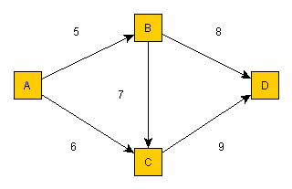

# License Notice
Notice that the "core" library with the API and general code is released with MIT License.
However, the libraries which are implementing adapters are licensed in the same way as the adapted libraries.
Currently there are three such adapter libraries, and if you intend to use one or more of them you must check their licenses:
* https://github.com/TomasJohansson/adapters-shortest-paths/tree/master/adapters-shortest-paths-impl-jgrapht
* https://github.com/TomasJohansson/adapters-shortest-paths/tree/master/adapters-shortest-paths-impl-bsmock
* https://github.com/TomasJohansson/adapters-shortest-paths/tree/master/adapters-shortest-paths-impl-yanqi


## Adapters for Java implementations of Graph algorithms for routing the shortest paths.

The purpose of this project is to provide Adapters for Java implementations of Graph algorithms for routing the shortest path**s**.<br>(the bold '**s**' above is intentional i.e. **not only** the single shortest path but the shortest path**s**)

**Currently there are three implemented Adapters**, i.e. three different implementations can be used.
Since the Client code is using the same Target interface (see the [Adapter Design Pattern](https://en.wikipedia.org/wiki/Adapter_pattern)) it is possible to **reuse the same test code for the different implementations**.
Therefore you can assert their results against each other, which could help finding bugs. If one implementation would produce a different result than the others, then it is likely a bug that should be reported and hopefully fixed. However, note that the tested graph need to be constructed in such a way that there must not be more than one path (among the first shortest paths you use test assertions for) with the same total weight. If multiple paths have the same total weight then it is not obvious which should be sorted first, and then it would not be surprising if different implementations produce different results.

When you run such [tests with the same data for different implementations](https://github.com/TomasJohansson/adapters-shortest-paths/blob/master/adapters-shortest-paths-test/src/test/java/com/programmerare/shortestpaths/graph/tests/BigGraphTest.java), then you can also easily **compare the performance for the different implementations**.       

### Example of how to use this shortest paths adapter library:

Consider a graph with four vertices (A,B,C,D) and five edges with weights.<br>(A to B (5) , A to C (6) , B to C (7)  , B to D (8) , C to D (9) ).<br><br>
There are three possible paths from A to D , with the total weight within parenthesis : 
* A to B to D (total cost: 13 = 5 + 8)
* A to C to D (total cost: 15 = 6 + 9)
* A to B to C to D (total cost: 21 = 5 + 7 + 9)

For example, the vertices might represent cities, and the edges might represent roads with distances as weights.

The Java code below can be used for finding the shortest paths (sorted with the shortest first) from A to D :

```java
import static com.programmerare.shortestpaths.core.impl.EdgeImpl.createEdge;
import static com.programmerare.shortestpaths.core.impl.VertexImpl.createVertex;
import static com.programmerare.shortestpaths.core.impl.WeightImpl.createWeight;
import java.util.Arrays;
import java.util.List;
import com.programmerare.shortestpaths.adapter.impl.bsmock.GraphFactoryBsmock;
import com.programmerare.shortestpaths.adapter.impl.jgrapht.GraphFactoryJgrapht;
import com.programmerare.shortestpaths.adapter.impl.yanqi.GraphFactoryYanQi;
import com.programmerare.shortestpaths.core.api.Edge;
import com.programmerare.shortestpaths.core.api.Graph;
import com.programmerare.shortestpaths.core.api.GraphFactory;
import com.programmerare.shortestpaths.core.api.Path;
import com.programmerare.shortestpaths.core.api.Vertex;
import com.programmerare.shortestpaths.core.api.Weight;

...

	Vertex a = createVertex("A");
	Vertex b = createVertex("B");
	Vertex c = createVertex("C");
	Vertex d = createVertex("D");

	List<Edge> edges = Arrays.asList(
		createEdge(a, b, createWeight(5)),
		createEdge(a, c, createWeight(6)),
		createEdge(b, c, createWeight(7)),
		createEdge(b, d, createWeight(8)),
		createEdge(c, d, createWeight(9))
	);

	GraphFactory<Edge> graphFactory = new GraphFactoryJgrapht<Edge>();
	// or: graphFactory = new GraphFactoryBsmock<Edge>();
	// or: graphFactory = new GraphFactoryYanQi<Edge>();
	// (currently there are three implementations)

	Graph<Edge> graph = graphFactory.createGraph(edges);
	List<Path<Edge>> shortestPaths = graph.findShortestPaths(a, d, 10); // last parameter is max number to return but in this case there are only 3 possible paths
	for (Path<Edge> path : shortestPaths) {
		Weight totalWeightForPath = path.getTotalWeightForPath();
		System.out.println(totalWeightForPath);
		List<Edge> pathEdges = path.getEdgesForPath();
		for (Edge edge : pathEdges) {
			Vertex startVertex = edge.getStartVertex();
			Vertex endVertex = edge.getEndVertex();
			Weight edgeWeight = edge.getEdgeWeight();					
			System.out.println(startVertex);
			System.out.println(endVertex);
			System.out.println(edgeWeight);
		}			
	}
```
Assuming you are using Maven, to be able to use the above code, you can use the following configuration in your "pom.xml" file :
```xml
<repositories>
	...
	<repository>
		<id>jitpack.io</id>
		<url>https://jitpack.io</url>
	</repository>
</repositories>
	
<dependencies>
	...
	<dependency>
		<groupId>com.github.TomasJohansson</groupId>
		<artifactId>adapters-shortest-paths</artifactId>
		<version>5308d2aec13d6147c864703e1e2284a970e8c42e</version> <!--https://github.com/TomasJohansson/adapters-shortest-paths/commits/master  -->
	</dependency>      
</dependencies>
```
Note that "jitpack" is used since currently there is no release of this library in the maven central repository.


### Some comments about the three libraries currently being used

There are currently Adapter implementations for the following three libraries:
* <https://github.com/jgrapht/jgrapht>
* <https://github.com/yan-qi/k-shortest-paths-java-version>
* <https://github.com/bsmock/k-shortest-paths>

Regarding the versions /"releases" being used:

* Regarding jgrapht, the [version 0.9.2](https://mvnrepository.com/artifact/org.jgrapht/jgrapht-core/0.9.2) is currently used. Later versions require Java 8, and if I change the Adapter project to also require Java 8 then I intend to upgrade to a later version of jgraph.         
* Regarding the ["yan-ki"](https://github.com/yan-qi/k-shortest-paths-java-version) implementation, there seems to be no official releases. Also, I could not find a way of reusing the library without modification since it seems to [require input from a file](https://github.com/yan-qi/k-shortest-paths-java-version/issues/4) which would mean I could not have used it as intended, e.g. programmatically generating a [big graph for comparison against other implementations](https://github.com/TomasJohansson/adapters-shortest-paths/blob/master/adapters-shortest-paths-test/src/test/java/com/programmerare/shortestpaths/graph/tests/BigGraphTest.java). This is one of the reasons why I instead use a [forked version](https://github.com/TomasJohansson/k-shortest-paths-java-version/commits/programmatic-graph-creation-without-using-inputfile). Another reason for using a fork is the limitation that the input vertices needs to be integer in a sequence, while the other libraries support general strings. I fixed this with a mapper class in [GraphFactoryYanQi](https://github.com/TomasJohansson/adapters-shortest-paths/blob/master/adapters-shortest-paths-impl-yanqi/src/main/java/com/programmerare/shortestpaths/adapter/impl/yanqi/GraphFactoryYanQi.java) and [GraphYanQi](https://github.com/TomasJohansson/adapters-shortest-paths/blob/master/adapters-shortest-paths-impl-yanqi/src/main/java/com/programmerare/shortestpaths/adapter/impl/yanqi/GraphYanQi.java) which maps back and forth from more general input strings.          
* Regarding the ["bsmock"](https://github.com/bsmock/k-shortest-paths) implementation, it was not even a maven project. Therefore I [forked](https://github.com/TomasJohansson/k-shortest-paths/commits/adding-maven-structure-and-junit-test) it and created a maven project of it. I have created a [pull request with my changes](https://github.com/bsmock/k-shortest-paths/pull/2).

The two interfaces [GraphFactory](https://github.com/TomasJohansson/adapters-shortest-paths/blob/master/adapters-shortest-paths-core/src/main/java/com/programmerare/shortestpaths/core/api/GraphFactory.java) and [Graph](https://github.com/TomasJohansson/adapters-shortest-paths/blob/master/adapters-shortest-paths-core/src/main/java/com/programmerare/shortestpaths/core/api/Graph.java) are implemented for the above libraries (i.e. the libraries are the "Adaptee" in the Adapter Design Pattern).
'GraphFactory' defines one method responsible for taking care of the Graph input in a common format as a list of Edges which need to be converted into an internal Graph structure for the implementation.
'Graph' defines one search method which will find the shortest path**s** between two nodes specified as input parameters.

The returned list of paths aggregate edges, and those edges will be the **same instances** as the input edges for the 'GraphFactory'.
This means that you can use for example your own database entities and send in your "Edge" instances to the 'GraphFactory' and then you will retrieve an instance of 'Graph' which will return a path containing your own entities as edges.
There is a code example with database entities for City (Vertex) and Road (Edge) which is implemented with SQLite as database and JPA as persistence API with Hibernate as implementation.
The database code can be used if you choose to do so with a parameter to the main method in [RoadRoutingMain](https://github.com/TomasJohansson/adapters-shortest-paths/blob/master/adapters-shortest-paths-example-project-jpa-entities/src/main/java/roadrouting/RoadRoutingMain.java)
          
Links to the 'GraphFactory' and 'Graph' classes for the three above libraries :

* [GraphFactoryJgrapht](https://github.com/TomasJohansson/adapters-shortest-paths/blob/master/adapters-shortest-paths-impl-jgrapht/src/main/java/com/programmerare/shortestpaths/adapter/impl/jgrapht/GraphFactoryJgrapht.java) and [GraphJgrapht](https://github.com/TomasJohansson/adapters-shortest-paths/blob/master/adapters-shortest-paths-impl-jgrapht/src/main/java/com/programmerare/shortestpaths/adapter/impl/jgrapht/GraphJgrapht.java)
* [GraphFactoryYanQi](https://github.com/TomasJohansson/adapters-shortest-paths/blob/master/adapters-shortest-paths-impl-yanqi/src/main/java/com/programmerare/shortestpaths/adapter/impl/yanqi/GraphFactoryYanQi.java) and [GraphYanQi](https://github.com/TomasJohansson/adapters-shortest-paths/blob/master/adapters-shortest-paths-impl-yanqi/src/main/java/com/programmerare/shortestpaths/adapter/impl/yanqi/GraphYanQi.java) 
* [GraphFactoryBsmock](https://github.com/TomasJohansson/adapters-shortest-paths/blob/master/adapters-shortest-paths-impl-bsmock/src/main/java/com/programmerare/shortestpaths/adapter/impl/bsmock/GraphFactoryBsmock.java) and [GraphBsmock](https://github.com/TomasJohansson/adapters-shortest-paths/blob/master/adapters-shortest-paths-impl-bsmock/src/main/java/com/programmerare/shortestpaths/adapter/impl/bsmock/GraphBsmock.java)

